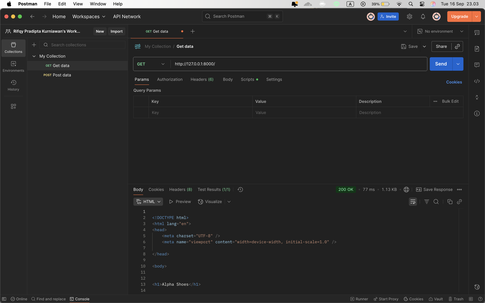
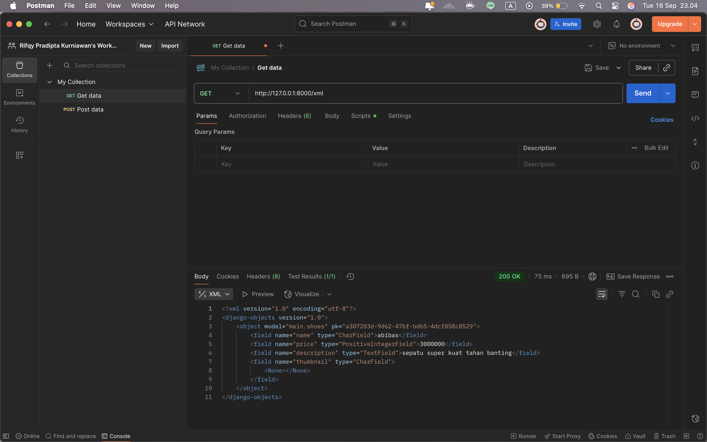
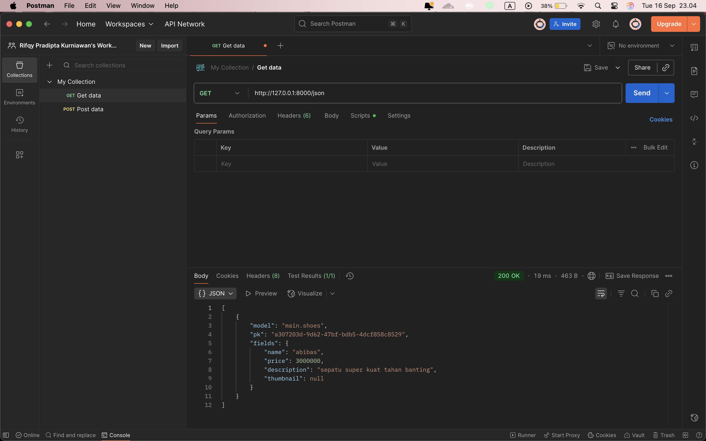
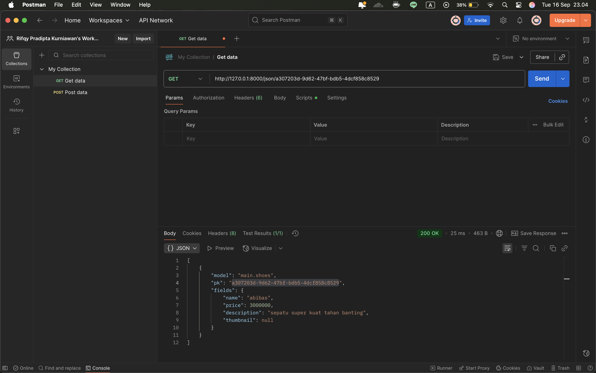
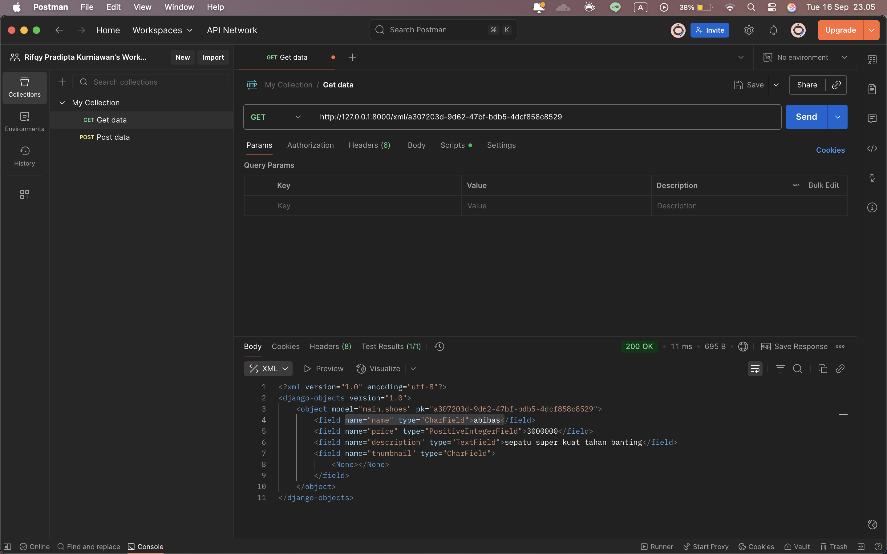
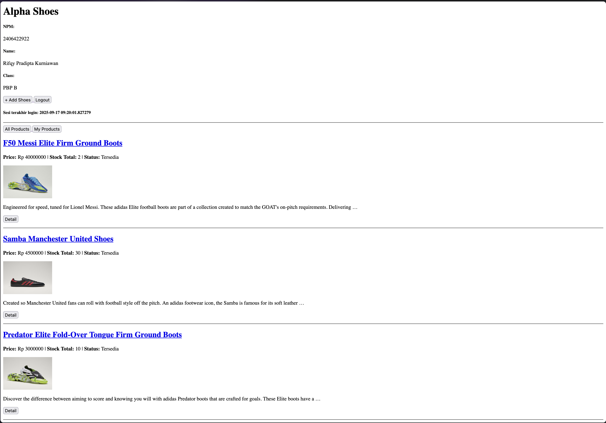
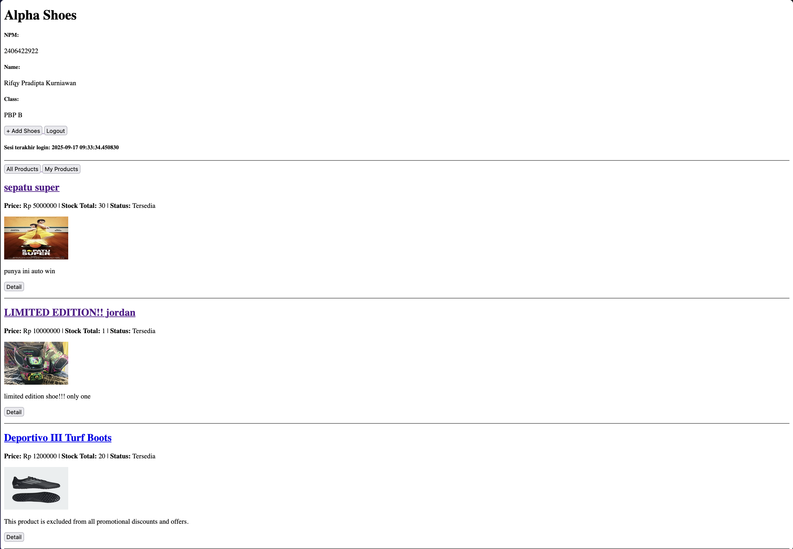
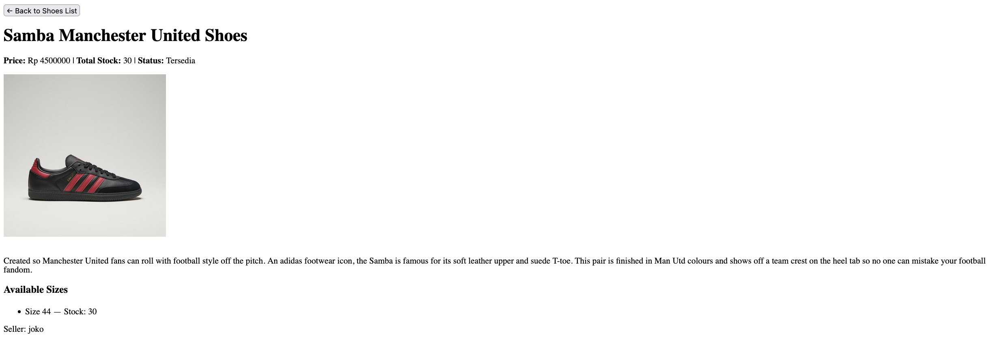

# Tugas PBP : Football Shop - Alpha shoes
[link to PWS](https://rifqy-pradipta-alphashoes.pbp.cs.ui.ac.id/)

---


<details>
<Summary><b>Tugas 2</b></Summary>

## checklist:
- [x] Membuat sebuah proyek Django baru.
	- Buat folder baru dan python venv dengan install seluruh requirement untuk setup Django.
	- Buat project baru: `django-admin startproject alpha_shoes`.
- [x] Membuat aplikasi dengan nama main pada proyek tersebut.
	- Buat aplikasi main dengan: `python manage.py startapp main`.
	- Tambahkan `main` pada **settings.py**, spesifiknya pada ==INSTALLED_APPS== agar main dikenali oleh Django.
- [x] Melakukan routing pada proyek agar dapat menjalankan aplikasi main.
	- Buat folder template serta file **main.html** di dalamnya, yang akan menjadi tampilan utama, untuk sekarang hanya display nama toko dan identitas, dalam bentuk placeholder.
	- Data yang akan ditampilkan pada main dibuat pada **views.py**, yang akan me-render **main.html** placeholder dengan value yang dimiliki views.
	- Routing program melalui **urls.py** dengan import **main.views** dan hook **main.urls**(file urls.py pada `main/`) ke **urls.py** pada direktori proyek `alpha_shoes/`.
- [x] Membuat model pada aplikasi main dengan nama Product dan memiliki atribut wajib sebagai berikut.

``` 
- name sebagai nama item dengan tipe CharField.
- price sebagai harga item dengan tipe IntegerField.
- description sebagai deskripsi item dengan tipe TextField.
- thumbnail sebagai gambar item dengan tipe URLField.
- category sebagai kategori item dengan tipe CharField.
- is_featured sebagai status unggulan item dengan tipe BooleanField
```

- pada models, saya menggunakan:
    - id(sebagai primary key database), 
    - name sebagai CharField, 
    - price sebagai PositiveIntegerField, 
    - description sebagai TextField, 
    - thumbnail sebagai URLField, 
    - size sebagai CharField, dan 
    - stock sebagai PositiveIntegerField.

- karena Shoe dapat memiliki berbagai size, saya menggunakan class tambahan bernama ShoeSize yang menjadi database kedua untuk melakukan store terhadap masing-masing dari size dan stok tiap sepatu. Berikut adalah model yang saya buat:


```python
class Shoes(models.Model):
    id = models.UUIDField(primary_key=True, default=uuid.uuid4, editable=False)
    name = models.CharField(max_length=255)
    price = models.PositiveIntegerField(default=0)
    description = models.TextField(blank=True)
    thumbnail = models.URLField(blank=True, null=True)

    def __str__(self):
        return self.name

    @property
    def total_stock(self):
        return sum(s.stock for s in self.sizes.all())

    @property
    def is_available(self):
        return self.total_stock > 0

    def decrease_stock(self, size, amount=1):
        size_row = self.sizes.get(size=size)
        if amount < 0:
            raise ValueError("tidak dapa negatif")
        if size_row.stock < amount:
            raise ValueError("stock tidak cukup")
        size_row.stock -= amount
        size_row.save()


class ShoeSize(models.Model):
    shoes = models.ForeignKey(Shoes, on_delete=models.CASCADE, related_name='sizes')
    size = models.CharField(max_length=2, choices=SIZE_CHOICES)
    stock = models.PositiveIntegerField(default=0)

    class Meta:
        unique_together = ('shoes', 'size')
```

- [x] Membuat sebuah fungsi pada views.py untuk dikembalikan ke dalam sebuah template HTML yang menampilkan nama aplikasi serta nama dan kelas kamu.
	- hal ini sudah saya lakukan bersamaan dengan routing diatas untuk mempersingkat waktu.
- [x] Membuat sebuah routing pada urls.py aplikasi main untuk memetakan fungsi yang telah dibuat pada views.py.
	-  hal ini juga sudah saya lakukan bersamaan dengan routing diatas untuk mempersingkat waktu.
- [x] Melakukan deployment ke PWS terhadap aplikasi yang sudah dibuat sehingga nantinya dapat diakses oleh teman-temanmu melalui Internet.
	- push project ke git PWS.
	- karena segala credential tidak dimasukkan dalam push, maka harus dilakukan setup environs pada PWS dengan credential-credential yang diperlukan.
	- PWS akan runserver dengan sendirinya.
- [x] Membuat sebuah README.md yang berisi tautan menuju aplikasi PWS yang sudah di-deploy, serta jawaban dari beberapa pertanyaan berikut.
---
##  Bagan  penjelasan mengenai kaitan antara urls.py, views.py, models.py, dan berkas html.


*gambar diambil dari. [^1]*
keempat file tersebut sangat berkaitan karena:
- `urls.py` (proyek & app): Mencocokkan URL → menentukan view mana dipanggil.
- `views.py`: Menerima request, (opsional) ambil data di `models.py`, lalu panggil **template** dengan context → print `HttpResponse`.
- `models.py`: Sumber data, desain tabel dan isinya(variabel) yang akan dipakai **view**.
- `templates/*.html`: Presentasi, menampilkan data yang dikirim **view** ke user dalam bentuk HTML.
Keempatnya terhubung menjadi: **URL → View → Model → Template → Response**.

---
## Peran settings.py dalam proyek Django
`settings.py` adalah **pusat konfigurasi proyek Django**. Semua pengaturan, dimulai dari database, lokasi aplikasi, lokasi template, hingga security disatukan dalam satu tempat, sehingga proyek bisa berjalan konsisten dan mudah diatur.
## Cara Kerja Migrasi Database di Django

Migrasi digunakan untuk menjaga sinkronisasi antara **models.py** dan **database**.
1. Buat/Ubah model di `models.py`.
2. Jalankan:
    ```bash
    python manage.py makemigrations
    ```
    Django membuat **file migrasi**.
3. Jalankan:
    ```bash
    python manage.py migrate
    ```
    Django mengeksekusi file migrasi, membuat atau mengubah tabel sesuai model.

Dengan migrasi, perubahan struktur database bisa **dilacak, dikelola, dan dijalankan otomatis** tanpa harus menulis kembali database secara manual.

---
## Kenapa Django?
Karena Django mencakup *FullStack* development sehingga dapat mengatur *FrontEnd* dan *BackEnd* secara mudah untuk pemula. Dengan menggunakan ==python==, Django menjadi alternatif yang banyak digunakan untuk pemula yang baru mempelajari dapat mengikuti dengan mudah disertai dengan dokumentasi yang lengkap.


</details>
<details>
<summary><b>Tugas 3</b></summary>

## checklist:
- [x] Tambahkan 4 fungsi `views` baru untuk melihat objek yang sudah ditambahkan dalam format XML, JSON, XML _by ID_, dan JSON _by ID_.
	- function baru dibuat pada views.py untuk menampilkan format-format tersebut.
- [x] Membuat routing URL untuk masing-masing `views` yang telah ditambahkan pada poin 1.
	```python
	path('create-shoes/', create_shoes, name='create_shoes'),
	path('shoes/<str:id>/', show_shoes, name='show_shoes'),
	path('xml/', show_xml, name='show_xml'),
	path('json/', show_json, name='show_json'),
	path('xml/<str:shoes_id>/', show_xml_by_id, name='show_xml_by_id'),
	path('json/<str:shoes_id>/', show_json_by_id, name='show_json_by_id'),
	```
- [x] Membuat halaman yang menampilkan data objek model yang memiliki tombol "Add" yang akan redirect ke halaman `form`, serta tombol "Detail" pada setiap data objek model yang akan menampilkan halaman detail objek.
	```html
	<a href="">
		<button>+ Add Shoes</button>
	</a>
	
	...
	...
	...
	
	<a href="">
		<button>Detail</button>
	</a>
	```
- [x] Membuat halaman `form` untuk menambahkan objek model pada app sebelumnya.

```python
class ShoesForm(ModelForm):
	class Meta:
		model = Shoes
		fields = ["name", "price", "description", "thumbnail"]
```

- [x] Membuat halaman yang menampilkan detail dari setiap data objek model.
	Cek **shoes_details.html** pada /main/template/shoes_details.html
---
##  Pengunaan *data delivery* pada sebuah platform.

Pada kasus project kali ini, data delivery yang dipakai adalah input user pada form yang di kirim ke database server sehingga data sepatu tetap tersimpan pada database. Hal ini diperlukan untuk mempermudah interaksi user dengan server.

---
## JSON or XML?
Menurut saya, json memiliki format yang lebih mudah dibaca dari sisi pengguna sehingga mempermudah pengolahan data tersebut. Kepopuleran JSON mungkin juga karena hal tersebut, ditambah pengolahan JSON juga dapat langsung diolah oleh javascript.
## fungsi dari method `is_valid()`
`is_valid()` digunakan untuk mengecek input dari form user agar sesuai dengan dengan field model yang sudah di define pada *models.py*.
## Fungsi **csrf_token**
**csrf_token** digunakan untuk mengecek apakah csrf tersebut berasal dari website kita atau berasal dari sumber yang tidak diketahui yang menyebabkan terjadinya CSRF vulnerability[^2]. Maka dari itu penggunaan token dibutuhkan untuk mencegah terjadinya hal-hal yang tidak diinginkan.

## Postman
<details>
<summary><b>Photos</b></summary>







</details>

</details>

<details>
<summary><b>Tugas 4</b></summary>

## checklist:
- [x] Mengimplementasikan fungsi registrasi, login, dan logout untuk memungkinkan pengguna mengakses aplikasi sebelumnya sesuai dengan status login/logoutnya..
	Fungsi register, login, dan logout dibuat pada *views.py*
- [x] Membuat **dua** (2) akun pengguna dengan masing-masing **tiga** (3) _dummy data_ menggunakan model yang telah dibuat sebelumnya untuk setiap akun **di lokal**.
	- User 1:
	
	- User 2:
	

- [x] Menghubungkan model `Product` dengan `User`.
	Menambahkan user pada product database dan mengaitkannya menjadi seller user saat add product. Jadi jika user melakukan click detail product seller akan ditampilkan sebagai seller yang menjual sepatu. 
	
- [x] Menampilkan detail informasi pengguna yang sedang _logged in_ seperti _username_ dan menerapkan _cookies_ seperti `last_login` pada halaman utama aplikasi.
	penerapan `last_login` hanya tinggal menambahkan  `last_login': request.COOKIES.get('last_login', 'Never')` pada context di **views.py**. Sedangkan untuk menampilkan username yang sedang login dapat dilakukan dengan mengganti hardcoded username dengan `request.user.username`

---
##  Pertanyaan dan Jawaban:
#### Apa itu Django `AuthenticationForm`? Jelaskan juga kelebihan dan kekurangannya.
`AuthenticationForm` adalah form bawaan dari `django.contrib.auth.forms` yang menyediakan field *username* dan *password*, melakukan validasi credential melalui `authenticate()` dan menyediakan `form.get_user()` bila valid.
**Kelebihan:**
- Praktis karena merupakan template siap pakai untuk proses login.
- Terintegrasi dengan sistem auth Django.
- Aman, karena hanya menerima credential sesuai format, ada simple cek bila username dan password mirip.
**Kekurangan:**
- UI sederhana, perlu styling tambahan.
- Tidak ada proteksi brute-force.
#### Apa perbedaan antara autentikasi dan otorisasi? Bagaiamana Django mengimplementasikan kedua konsep tersebut?
**Autentikasi (Authentication)** adalah verifikasi identitas, menandakan siapa yang sedang login saat ini.
- Django menggunakan `authenticate()` lalu `login(request, user)`.
- Form menggunakan `AuthenticationForm` untuk memfasilitasi input + validasi.

**Otorisasi (Authorization)** adalah pengecekan hak akses, menandakan user yang sedang login saat ini dapat mengakses apa saja.
- Modifier `@login_required` untuk memberikan authorization hanya kepada user yang sudah melakukan register dan login, jika tidak produk tidak akan ditampilkan dan di forward ke page login.
#### Apa saja kelebihan dan kekurangan _session_ dan _cookies_ dalam konteks menyimpan _state_ di aplikasi web?
**Session (server-side dan cookie hanya menyimpan session id)**
- **Kelebihan:**
    - Lebih aman karena data tidak disimpan di client.
    - Bisa menyimpan data besar & kompleks.
- **Kekurangan:**
    - Memerlukan storage server sendiri untuk menyimpan session tersebut.
    - Perlu perhatian jika ingin melakukan modifikasi storage, jika terhapus dengan tidak sengaja akan menjadi rumit.

**Cookies (client-side)**
- **Kelebihan:**
    - Simpel; tidak butuh storage server.
    - Cocok untuk setting yang tidak terlalu banyak, misal hanya asal user(ex: ID).
- **Kekurangan:**
    - Terbatas ukuran, hanya sekitar ~4KB.
    - Dikirim tiap request.
    - Rentan dimodifikasi oleh user lain.
    - Rentan dicuri melalui XSS jika tidak `HttpOnly`.
#### Apakah penggunaan _cookies_ aman secara _default_ dalam pengembangan web, atau apakah ada risiko potensial yang harus diwaspadai? Bagaimana Django menangani hal tersebut?
Tidak. Cookie **tidak otomatis** aman, ada beberapa risiko seperti XSS, MITM, CSRF, dan tampering.
**Risiko potensial:**
- XSS → pencurian cookie jika function javascript tidak aman.
- Sniffing → bocor bila tidak `Secure` + HTTP, hacker dapat memotong interaksi user dengan server melalui monitor mode dan melakukan sniffing pada network jika dilakukan pada protokol yang tidak aman seperti HTTP, baiknya gunakan HTTPS.
- CSRF → eksploitasi session cookie antar site.
- Tampering → mengubah nilai cookie biasa, biasanya menggubah variabel role menjadi admin jika tidak dilakukan validasi.
**Bagaimana Django mengatasi:**
- Default session cookie (`sessionid`) + server-side session storage → data sensitif tidak di client, sehingga penyerangan diatas sulit dilakukan.
- `CsrfViewMiddleware` + `` mencegah CSRF.

</details>

</details>
---

#### Apakah ada feedback untuk asisten dosen tutorial x yang telah kamu kerjakan sebelumnya?
Keren :0, terimakasih sudah memberikan tutorial lengkap.


---
[^1]:https://medium.com/@developerstacks/django-request-response-cycle-7165167f54c5
[^2]:https://portswigger.net/web-security/csrf